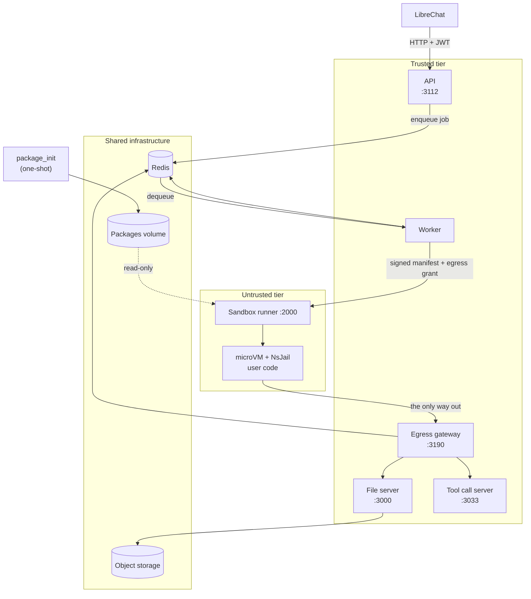

The service is deliberately several processes rather than one. The split is
not about scale: it is about **privilege**. Each boundary exists so that
compromising one component does not hand an attacker the capabilities of
another.

## The components

| Component | Source | Port | Trust | Role |
| --- | --- | --- | --- | --- |
| **API** | `service/src/api-server.ts` | 3112 | Trusted | Authenticates, validates, enqueues, waits for the result. |
| **Worker** | `service/src/worker-server.ts` | 3113 (health) | Trusted | Consumes jobs, mints capabilities, drives the sandbox, handles persistence. |
| **Sandbox runner** | `api/src/` | 2000 | **Untrusted-adjacent** | Executes code. Holds only a public verifier key. |
| **File server** | `service/src/file-server.ts` | 3000 | Trusted | S3-backed object storage. |
| **Tool call server** | `service/src/tool-call-server.ts` | 3033 | Trusted | Routes tool calls between sandbox and caller. |
| **Egress gateway** | `service/src/egress-gateway.ts` | 3190 | Trusted | The single network path out of a sandbox; enforces capabilities. |
| **package_init** | `docker/Dockerfile.package-init` | n/a | Build-time | Installs language runtimes onto a shared volume. |
| **Launcher** | `launcher/` (Rust) | n/a | Untrusted-adjacent | Boots the libkrun microVM and execs into the guest. |

Plus Redis (queue, session pointers, egress ledger) and S3-compatible object
storage.

## Why the API and worker are separate

The API is a public-facing HTTP server. The worker holds the **execution
manifest private key**.

If they were one process, every request-handling bug would be adjacent to the
signing key. Splitting them means the component parsing untrusted JSON from the
internet cannot mint execution capabilities: it can only ask, over a queue, for
one to be minted.

## Why the sandbox runner holds only a public key

The runner is the component nearest to untrusted code. It **verifies** manifests
with a public key; it cannot **sign** them.

A fully compromised runner therefore cannot mint a new manifest granting itself
access to other users' files. It is limited to whatever the manifest it was
handed already authorises, which is scoped to one execution, one set of input
files, one output session, with expiry.

<Callout type="info">
There is a legacy HMAC fallback (`executionManifestSecret`) for non-split
deployments, where one secret both signs and verifies. Never mount that into
the sandbox runner: doing so hands it the ability to mint manifests and
collapses this whole property.
</Callout>

## Why the egress gateway exists

The sandbox has no network. It cannot reach the file server, Redis, object
storage, or the internet.

The one exception is a single host port forwarded to the egress gateway
(`SANDBOX_ALLOWED_LOCAL_NETWORK_PORT`). Every request through it carries an
**egress grant**: an encrypted, scoped capability naming exactly which files
this run may read, which session it may write to, and how many requests, bytes,
and output files it is allowed.

Without this, "the sandbox needs to download its input files" would mean giving
untrusted code a credential to the file server. The gateway turns that into a
capability scoped to one execution.

See [The egress model](/docs/developers/egress).

## Request flow

<Steps>

<Step>
### The API receives a request

`POST /v1/exec` on port 3112. The API:

- authenticates the principal (JWT, `none`, or local mode);
- derives the `sessionKey` server-side from that principal and the resource;
- authorizes every referenced input file against that namespace;
- mints a `session_id` (which is also the output storage prefix) and an
  `execution_id`;
- enqueues a job on the Python or `other` Redis queue.
</Step>

<Step>
### The worker picks it up

The worker:

- builds the payload, wrapping the user's code where needed (the matplotlib
  template, the persistence wrapper, the tool-call preamble);
- builds the **execution manifest claims**: principal, session key, input
  files, output session, budgets;
- mints an **egress grant** and records it in the Redis **egress ledger**;
- signs the manifest with the Ed25519 private key, binding a SHA-256 of the
  request body so no field can change after signing;
- calls the sandbox runner.
</Step>

<Step>
### The sandbox runner executes

The runner:

- verifies the manifest signature, expiry, and body hash;
- checks the request's scope against the manifest claims;
- leases an isolated workspace and a per-job UID;
- fetches input files through the egress gateway using the grant;
- installs per-job dependencies, if enabled, in the **trusted runner** context;
- runs the code under NsJail: inside the microVM guest when KVM is on;
- collects `/mnt/data`, uploads new files through the gateway;
- returns stdout, stderr, exit status, and file refs.
</Step>

<Step>
### The result comes back

The worker returns the result through Redis; the API returns it to the caller.
With persistence enabled, the worker also advances the session pointer via a
compare-and-swap.
</Step>

</Steps>

See [Execution lifecycle](/docs/developers/execution-lifecycle) for the detailed
version.

## Two queues

| Queue | Default concurrency | Why |
| --- | --- | --- |
| `python-queue` | `PYTHON_CONCURRENCY=1` | Python jobs are heavy: scientific imports alone cost real memory and CPU. |
| `other-queue` | `OTHER_CONCURRENCY=8` | Bash, JS, TS, and Java runs are comparatively cheap. |

Separating them stops a burst of pandas work from starving trivial Bash runs.

## State

| Where | What |
| --- | --- |
| **Redis** | Job queues, `session:<id> → sessionKey` cache, the egress ledger, persistent-session pointers, tool-call sessions, rate-limit counters. |
| **Object storage** | Uploaded files, run output artifacts, persistent-session workspace snapshots. |
| **Packages volume** | Language runtimes, populated by `package_init`, mounted read-only into runners. |
| **Sandbox workspace** | `/tmp/sandbox/ws_*` on the runner, one per execution, destroyed after. |

Everything durable lives in Redis or object storage, so workers are
interchangeable: a persistent session can resume on any worker, and no
affinity is needed.

## The runtime split: two codebases

The repository holds two TypeScript codebases that ship together but run
apart:

- **`service/`**: API, worker, file server, tool call server, egress gateway.
  Node/Bun, built with Rollup.
- **`api/`**: the sandbox runner. Bun, and the component that talks to NsJail.

They share wire types by convention rather than a published package, because
they always deploy as a set. Several comments in the code note that a field
rename is a hard rename with no back-compat alias for exactly this reason.

Plus **`launcher/`**, a small Rust binary that calls libkrun's FFI to boot the
microVM and exec into the guest.

## Next

<Cards>
  <Card
    title="Repository layout"
    description="Where everything lives, directory by directory."
    href="/docs/developers/repo-layout"
  />
  <Card
    title="Execution lifecycle"
    description="One request, traced end to end through the code."
    href="/docs/developers/execution-lifecycle"
  />
  <Card
    title="Security model"
    description="Manifests, grants, and the trust boundaries in detail."
    href="/docs/developers/security-model"
  />
  <Card
    title="Sandbox isolation"
    description="NsJail, seccomp, cgroups, and the microVM."
    href="/docs/developers/sandbox-isolation"
  />
</Cards>
