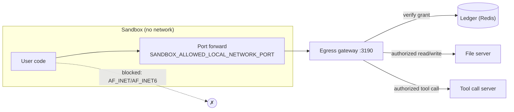

The sandbox has no network access of its own. (The opt-in
[sandbox networking](/docs/guides/networking) feature adds a proxied HTTP path
for user code; it is off by default and does not change anything below.) Yet it
must download input files, upload
results, and route tool calls. The egress gateway is how that happens without
giving untrusted code a credential.

## The problem

A sandbox needs to read its input files. The naive solution is to give it
credentials for the file server, which hands untrusted code the ability to read
*any* file the service can reach.

The gateway replaces that credential with a **capability**: a token that names
exactly which objects this one execution may touch, for how long, and how many
times.

## The single path out



Two independent mechanisms enforce this:

1. **The seccomp policy** blocks `AF_INET` and `AF_INET6` socket creation
   outright, so ordinary network calls fail at the syscall layer.
2. **The network namespace is empty** (`clone_newnet: true`), so even permitted
   sockets have nowhere to go.

<Callout type="warn">
Layer 2 is weaker than it looks on KVM/libkrun runners: libkrun's TSI
intercepts `AF_INET` at the guest socket layer and forwards it to the host, so
an allowed socket bypasses the namespace entirely. There, layer 1 — the seccomp
block — is the *only* thing keeping user code off the network. Do not relax it
on a libkrun deployment; [sandbox networking](/docs/guides/networking) is built
so that it never has to be.
</Callout>

The one exception is a single forwarded port:

```bash
SANDBOX_ALLOWED_LOCAL_NETWORK_PORT=3190
SANDBOX_FORWARD_TARGET=egress_gateway:3190
```

## Gateway routes

`service/src/egress-gateway.ts`.

### Sandbox-facing

Presented with an egress grant on every call:

| Route | Purpose |
| --- | --- |
| `GET /sessions/:sessionHandle/objects` | List objects in an authorized session |
| `GET /sessions/:sessionHandle/objects/:objectHandle` | Read an authorized object |
| `PUT /sessions/:sessionHandle/objects/:fileId` | Write to the authorized output session |
| `POST /tool-call` | Route a tool call to the tool call server |

Note the *handles*: the sandbox does not address storage sessions by their real
ids. Handles resolve only within the scope its grant already authorizes.

### Trusted-component routes

Require `CODEAPI_INTERNAL_SERVICE_TOKEN`:

| Route | Purpose |
| --- | --- |
| `POST /internal/egress-grants` | Register a grant in the ledger |
| `POST /internal/egress-grants/:grantId/revoke` | Revoke mid-execution |
| `POST /internal/egress-grants/:grantId/restore-result` | Report a persistence restore outcome |
| `POST /internal/ptc-callback-token` | Mint a tool-call callback token |

### Operational

`GET /live`, `GET /health`, `GET /ready`, `GET /metrics`.

## What a grant authorizes

```ts
{
  grant_id, exec_id, tenant_id, user_id,
  session_key,
  input_files,          // exactly which files may be read
  read_sessions,        // which storage sessions may be read
  output_session_id,    // the ONE session that may be written
  max_upload_bytes,
  max_output_files,
  max_requests,
}
```

Grants are **encrypted** (prefix `ceg1`, AAD `codeapi-egress-grant:v1`), not
merely signed, the sandbox cannot read its own grant, let alone alter it.

Two consequences worth stating:

- **Reads are enumerated, not pattern-matched.** The grant lists files, so
  guessing an object id gains nothing.
- **There is exactly one writable session.** A run cannot write into another
  run's output, including its own past runs'.

## The ledger

A stateless token cannot express "you have used 3 of your 10 uploads." Counters
live in Redis (`service/src/egress-ledger.ts`):

```ts
{
  grant_id, exec_id, status: 'active' | 'revoked', exp,
  input_files, read_sessions, output_session_id,
  max_upload_bytes, max_output_files, max_requests,
  request_count, read_count, upload_count, tool_call_count,
  uploaded_bytes, output_file_ids,
}
```

Every gateway request looks up the record, checks status and expiry, verifies
the operation is in scope, checks the relevant budget, and atomically increments
the counter.

```bash
CODEAPI_EGRESS_LEDGER_REQUIRED=true   # default
```

With this on, a grant with no live ledger entry is refused outright, so a
grant captured from a finished execution is worthless.

Mutations run through a dedicated Redis connection pool (32 connections by
default, `CODEAPI_EGRESS_LEDGER_MUTATION_CONNECTIONS`) with bounded retries,
because they are compare-and-swap operations under concurrency.

## Size limits

| Variable | Default | Bounds |
| --- | --- | --- |
| `EGRESS_GATEWAY_MAX_FILE_BYTES` | `10000000` | One user output file |
| `EGRESS_GATEWAY_MAX_TOOL_CALL_BYTES` | `1048576` | One tool call payload |

<Callout type="info" title="The session snapshot is exempt">
The persistent-session workspace snapshot is written through the same gateway,
but it is **not** a user output file. The gateway and ledger exempt it from
`EGRESS_GATEWAY_MAX_FILE_BYTES` and enforce a grant cap derived from
`CODEAPI_SESSION_STATE_MAX_BYTES` instead, which is why that is the only knob
bounding snapshot size.
</Callout>

## Tool calls

A tool call is egress like any other: the sandbox posts to `/tool-call` with its
grant, the gateway checks the tool-call budget and payload size, and forwards to
the tool call server, which correlates it with the paused execution.

The sandbox cannot invent a call for a tool that was not declared, cannot exceed
its budget, and cannot reach the tool call server directly.

Callback tokens are minted by trusted components via
`POST /internal/ptc-callback-token`, so the sandbox never holds a
credential: only a capability that the gateway resolves on its behalf.

## Persistent-session restores

Restoring a snapshot needs no special authorization path. The prior snapshot is
injected as an ordinary **synthetic input file** before the manifest is built,
so its storage session flows into `read_sessions` and `input_files` like any
other input.

The result: no exception in the file server, no exception in the auth layer, and
the snapshot is covered by the signature exactly like user data.

`POST /internal/egress-grants/:grantId/restore-result` reports whether the
restore succeeded, which drives the pointer-TTL logic described in
[the execution lifecycle](/docs/developers/execution-lifecycle).

## Why encryption rather than signing

A signed grant would be readable by the sandbox, exposing the ids of every file
in scope, the session key, and the tenant and user ids. None of that is
information untrusted code needs. Encrypting the grant keeps it opaque: the
sandbox holds a token it can present but not inspect.

## Failure modes

| Reason | Meaning |
| --- | --- |
| `missing_secret` | Gateway has no grant secret configured. |
| `weak_secret` | Secret shorter than 32 bytes. |
| `malformed` | Token unparseable or fails authenticated decryption. |
| `expired` | Past its expiry. |
| `wrong_type` | Not a grant token. |
| `scope_mismatch` | The requested object is not in scope. |

Budget exhaustion and revocation are reported by the ledger rather than as grant
errors, since the grant itself is still valid: it has simply run out.
