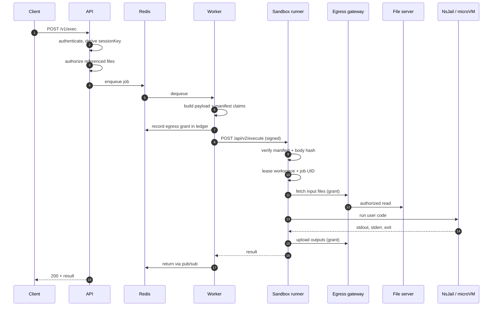

This traces a single execution from HTTP request to response, naming the code
that does each step. It is the map to read before changing anything on the
execution path.

## Overview



## 1. The API

`service/src/service/router.ts`, the `POST /exec` handler.

<Steps>
<Step>
### Rate limiting

`executionLimiter`: 20 requests per 30 s per principal by default, Redis-backed
so it holds across API replicas.
</Step>

<Step>
### Principal resolution

`getPrincipalOrReject` establishes who is calling. `getExecutionIdentity`
resolves the execution identity and tenant. In JWT mode this comes from verified
claims; in `none` mode from the `User-Id` header; in local mode from a fixed
principal.
</Step>

<Step>
### Lifecycle gates

`checkServiceShutDown()` and `checkServiceStartUp()` return `503` if the process
is not currently accepting work. This is what makes rolling restarts drain
cleanly.
</Step>

<Step>
### Language resolution

`resolveLanguage(rawLang)` maps the wire value onto a known language, `400` on
failure.
</Step>

<Step>
### File authorization

`authorizeRequestedFiles` checks every referenced input against the caller's
derived namespace. A reference the caller does not own fails here: before any
capability is minted.

The hidden persistent-session snapshot is explicitly rejected if referenced by
id, so a caller cannot address internal state as if it were their own file.
</Step>

<Step>
### Session key and ids

`resolveOutputBucketSessionKey(req)` derives the output namespace. Outputs are
**always** user-private, even when inputs were skill- or agent-scoped.

A fresh `session_id` and `execution_id` are minted, and
`session:<session_id> → sessionKey` is cached in Redis with `SESSION_CACHE_TTL`.
</Step>

<Step>
### Payload construction

`createPayload` builds the job. Notably `isPyPlot`: a static scan of *this
run's own source* for `import matplotlib` or `import seaborn`. When true, the
code is embedded in the matplotlib template so figures are captured.

<Callout type="info" title="Why isPyPlot stays a per-run scan">
It was once broadened to fire on any persistent-session continuation, to catch a
restored `plt` alias used without a fresh import. That broke user code
containing `from __future__ import ...`: inside the template the future import
is no longer the first statement of its compilation unit, which is a
`SyntaxError`. It was reverted; the restored-`plt`-without-reimport gap is a
known, smaller limitation.
</Callout>
</Step>

<Step>
### Persistence injection

With `CODEAPI_PERSIST_SESSIONS=true`, the worker path marks the payload to
snapshot `/mnt/data` back to this run's output session, and (if a prior
snapshot exists) injects it as a **synthetic input file**.

Being an ordinary input file, its `storage_session_id` flows into the manifest's
`read_sessions` and `input_files`, authorizing the fetch with no special case in
the file server or its auth. This happens *before* the manifest is built, so the
snapshot is covered by the signature.
</Step>

<Step>
### Enqueue

The job goes onto the Python or `other` queue. The API then waits on the job's
completion event and returns the result.
</Step>
</Steps>

## 2. The worker

`service/src/workers.ts` and `sandbox-dispatch.ts`.

The worker builds the security envelope:

**Execution manifest claims**: principal, tenant, session key, the input files
this run may read, the output session it may write, and budgets
(`EXECUTION_MANIFEST_MAX_UPLOAD_BYTES`, `MAX_OUTPUT_FILES`, `MAX_REQUESTS`).

**Egress grant**: an encrypted capability over the same scope, recorded in the
Redis **egress ledger** with counters the gateway decrements.

**Signature**: `buildSandboxExecuteRequest` computes
`executionManifestBodySha256(body)` and signs the claims together with that
hash, `iat`, and `exp`.

```ts
body.execution_manifest = signExecutionManifestWithKey(
  { ...claims, execute_body_sha256: hash, iat, exp },
  { privateKey, secret },
);
```

<Callout type="info" title="Why capabilities ride in the body">
Both the grant and the manifest are sent in the JSON body rather than HTTP
headers. Skill-heavy executions produce capabilities large enough to exceed
header size limits and fail with `431` *before* the runner could validate them.
Header forms are still accepted so rolling upgrades work.
</Callout>

## 3. The sandbox runner

`api/src/api/v2.ts` → `api/src/job.ts`.

<Steps>
<Step>
### Manifest verification

`verifyExecuteRequestManifest` checks the Ed25519 signature against the **public
key**, then expiry, not-before, and the body hash. A mismatch on any of these is
rejected with one of: `missing_header`, `malformed`, `invalid_signature`,
`expired`, `not_yet_valid`, `scope_mismatch`.

The body hash is what makes the manifest non-transferable: a manifest signed
for one request cannot be replayed onto a different one.
</Step>

<Step>
### Scope checks

The request's declared files, output session, and options are checked against
what the manifest actually authorizes.

`authorizeToolCallSocket` is a good example of the strictness: requesting a
tool-call socket requires the manifest to both allow it *and* be body-bound.
</Step>

<Step>
### Workspace lease

`workspace-isolation.ts` leases a fresh workspace under `/tmp/sandbox/ws_*` with
mode `0711`: non-listable, but traversable, which NsJail's bind-mount setup
requires.

With `SANDBOX_PER_JOB_UIDS=true`, a distinct UID/GID from a pool based at
`SANDBOX_JOB_UID_BASE` is allocated, so concurrent jobs on the same runner are
isolated from each other by ordinary filesystem permissions, not just by
namespaces.
</Step>

<Step>
### Input staging

Inline `content` is written directly. Files identified by `(id,
storage_session_id)` are fetched **through the egress gateway** using the grant.
Read-only inputs get `0444`; staged files get `0600`.
</Step>

<Step>
### Dependency install

If the submitted code carries a `# requirements:` declaration and the feature
is enabled, `api/src/dependencies.ts` parses it out of the source and validates
every spec against a strict grammar, then
pip installs with `--only-binary=:all:` **in the trusted runner**, as the
per-job UID, with a minimal environment. The result is mounted read-only into
the sandbox on `PYTHONPATH`.

See [Dynamic dependencies](/docs/guides/dependencies).
</Step>

<Step>
### Execution

`nsjail.ts` builds the invocation: namespace flags, the mount table, the Kafel
seccomp policy, cgroup limits, rlimits, and UID mapping. In microVM mode this
all happens *inside* the libkrun guest, which the Rust launcher booted.

`nsjail-setup-gate.ts` serialises setup with a watchdog:
`codeapi_sandbox_nsjail_setup_gate_watchdog_fires_total` should stay at zero.
</Step>

<Step>
### Output collection

`/mnt/data` is walked. New and modified files are uploaded through the gateway,
which enforces the grant's output-file count and byte budgets.

Refs are classified: `inherited: true` for unchanged passthroughs of inputs the
caller already owns, `modified_from` when a staged input was changed rather than
a new file created. Symlinks are stripped; permissions are restored.
</Step>

<Step>
### Snapshot

With persistence on, `/mnt/data` is tarred and uploaded under the run's output
session. Oversize snapshots (`CODEAPI_SESSION_STATE_MAX_BYTES`) are **skipped
(the run still succeeds**) and the response reports
`session_state_persisted: false`.
</Step>

<Step>
### Teardown

The workspace is destroyed and the UID returned to the pool. A reaper cleans up
anything orphaned older than `SANDBOX_WORKSPACE_REAPER_MAX_AGE_SECONDS`.
</Step>
</Steps>

## 4. Back through the worker

The worker returns the result and, with persistence enabled, advances the
session pointer with a **compare-and-swap**.

<Callout type="warn" title="First writer wins">
Concurrent runs that restored the same snapshot race here. The first to finish
and publish advances the session; the later finisher's snapshot is **discarded:
never merged, never rolled back**. A refcount on in-flight restores stops a
concurrent run from deleting a snapshot another run is still restoring from.
</Callout>

The pointer's TTL is refreshed on success. It is deliberately *not* refreshed
when `session_state_restore_failed` is set: pinning a dead snapshot alive would
brick the session, and letting the failure streak release the pointer is the
intended pressure valve.

## Failure classification

`api/src/safe-error.ts` decides what may be returned to a caller. Sandbox
internals (paths, UIDs, host details) must not leak through error messages, so
errors are classified into a safe public shape before crossing back.

| Status | Meaning |
| --- | --- |
| `400` | Validation failed: unknown runtime, malformed files, bad limits. |
| `401` | Manifest missing, malformed, expired, unsigned, or out of scope. |
| `415` | Not `application/json`. |
| `500` | Sandbox setup or execution failure. |

A user program that crashes is **not** an error at this layer: it returns `200`
with a non-zero `code` or a non-null `signal`.
