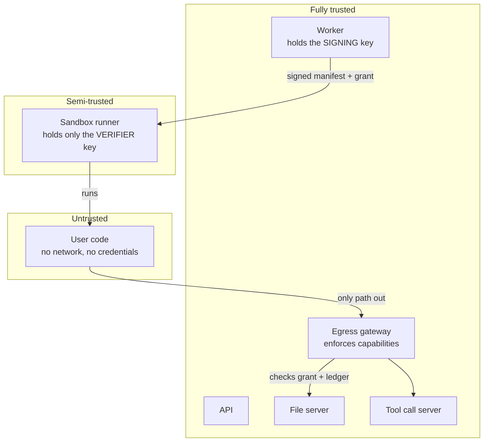

The isolation mechanisms keep code *inside* the sandbox. This page covers the
other half: what the sandbox is *allowed to do* once it is running, and how that
is enforced without trusting it.

## Trust boundaries



The design assumption is that **the sandbox runner may be compromised**. Every
capability it holds is therefore scoped, signed elsewhere, time-limited, and
budgeted.

## Execution manifests

An execution manifest is an Ed25519-signed statement of what one execution is
permitted to be. The worker signs it; the sandbox runner verifies it.

`service/src/execution-manifest.ts` signs; `api/src/execution-manifest.ts`
verifies.

### The asymmetry is the point

```ts
export interface ExecutionManifestSigner {
  /** Preferred signer for split-runner deployments. The sandbox-runner only
   * receives the matching public key, so runner compromise does not create a
   * new manifest-minting capability. */
  privateKey?: string;
  /** Legacy HMAC fallback for non-split deployments. Do not mount this into
   * sandbox-runner; it can both verify and mint manifests. */
  secret?: string;
}
```

A compromised runner can verify manifests. It cannot create them. So it is
confined to whatever it was already handed: one execution, one set of input
files, one output session, with an expiry.

<Callout type="error" title="Never mount the HMAC secret into the runner">
The legacy `secret` mode both signs and verifies. Putting it on the runner
collapses the entire asymmetry: a compromised runner could then mint a manifest
granting itself access to any user's files.
</Callout>

Configuration:

```bash
CODEAPI_EXECUTION_MANIFEST_PRIVATE_KEY=...   # worker ONLY
SANDBOX_EXECUTION_MANIFEST_PUBLIC_KEY=...    # sandbox runner ONLY
```

Both accept PEM or base64-encoded DER (PKCS#8 for the private key, SPKI for the
public key).

### Body binding

The manifest carries `execute_body_sha256`, a hash of the request body it was
signed for:

```ts
body.execution_manifest = signExecutionManifestWithKey(
  { ...claims, execute_body_sha256: executionManifestBodySha256(body), iat, exp },
  { privateKey, secret },
);
```

This makes manifests **non-transferable**. A manifest captured from one request
cannot be replayed onto another: changing any field invalidates the hash.

### Verification failures

| Reason | Meaning |
| --- | --- |
| `missing_header` | No manifest present, and one is required. |
| `missing_secret` | The runner has no verifier configured. |
| `malformed` | Not parseable. |
| `invalid_signature` | Signature check failed. |
| `expired` | Past `exp`. |
| `not_yet_valid` | Before `nbf`. |
| `scope_mismatch` | The request asks for something the manifest does not authorize. |

`SANDBOX_REQUIRE_EGRESS_MANIFEST=true` (default) makes an unsigned request an
outright rejection.

### Budgets

Manifest claims carry limits the gateway enforces:

| Variable | Bounds |
| --- | --- |
| `EXECUTION_MANIFEST_TTL_SECONDS` | Validity window (default 300 s) |
| `EXECUTION_MANIFEST_MAX_UPLOAD_BYTES` | Total upload bytes |
| `EXECUTION_MANIFEST_MAX_OUTPUT_FILES` | Output file count |
| `EXECUTION_MANIFEST_MAX_REQUESTS` | Total gateway requests |

## Egress grants

Where the manifest says what the *execution* is, the egress grant is the
capability the *sandbox* presents on every outbound request.

`service/src/egress-grant.ts` mints them. Claims include:

```ts
{
  v: 1,
  typ: 'grant',
  grant_id, exec_id, tenant_id, user_id,
  session_key,
  input_files,          // exactly which files may be read
  read_sessions,        // which storage sessions may be read
  output_session_id,    // the single session that may be written
  // plus budgets: max_upload_bytes, max_output_files, max_requests
}
```

Grants are **encrypted**, not merely signed, with authenticated additional data
(`codeapi-egress-grant:v1`) and the `ceg1` prefix. The sandbox cannot read its
own grant's contents, let alone alter them.

```bash
CODEAPI_EGRESS_GRANT_SECRET=<32+ bytes>
```

A secret shorter than 32 bytes is rejected with `weak_secret`.

## The egress ledger

A signed capability alone cannot express "you have used 3 of your 10 uploads",
so counters live server-side in Redis. `service/src/egress-ledger.ts` maintains
one record per grant:

```ts
{
  grant_id, exec_id, status: 'active' | 'revoked', exp,
  input_files, read_sessions, output_session_id,
  max_upload_bytes, max_output_files, max_requests,
  request_count, read_count, upload_count, tool_call_count,
  uploaded_bytes, output_file_ids,
}
```

This gives three properties a stateless token cannot:

1. **Budgets are actually enforced** across requests, not just declared.
2. **Revocation works**: a grant can be killed mid-execution.
3. **Replay is bounded**: a captured grant is still subject to counters that
   have already been consumed.

```bash
CODEAPI_EGRESS_LEDGER_REQUIRED=true   # default
```

With this on, a grant with no live ledger entry is refused. Ledger mutations run
through a dedicated Redis connection pool with bounded retries, since they are
compare-and-swap operations under concurrency.

## Internal service authentication

Separate from user auth, components authenticate to each other with a shared
token (`service/src/internal-service-auth.ts`):

```bash
CODEAPI_INTERNAL_SERVICE_TOKEN=<strong random value>
```

<Callout type="error">
When unset, file-object routes and Tool Call Server session-management routes
stay **unauthenticated** for backwards compatibility. On any network where the
internal segment is not fully trusted, this is a genuine hole.
</Callout>

## Storage namespace derivation

`service/src/session-key.ts` derives the `sessionKey` from the authenticated
principal and the resource the file belongs to. The caller never supplies it,
so there is no field in which to forge one.

| Kind | Namespace includes | Notes |
| --- | --- | --- |
| `user` | The user from the auth context | `resource_id` is informational |
| `agent` | The agent's resource id | Shared across that agent's users |
| `skill` | Resource id **and** `version` | Each revision is its own namespace |

Because a skill's version counter is monotonic, editing a skill invalidates the
previous cache entry naturally: the new version derives a different key.

Outputs are **always** user-private, hardcoded regardless of input kinds. A run
reading a shared skill bundle still writes into the requesting user's own
namespace.

### Tenant isolation

```bash
CODEAPI_TENANT_ISOLATION_STRICT=true
```

The namespace can include a tenant dimension. Deployments that do not populate a
tenant id fall back to `legacy`; strict mode rejects those requests instead of
silently pooling them. Turn it on for anything multi-tenant.

## Fail-fast startup

Both `service/src/secure-startup.ts` and `api/src/secure-startup.ts` validate
configuration at boot and refuse to start on an insecure combination. Examples:

- `CODEAPI_AUTH_PROVIDER=none` without `CODEAPI_ALLOW_AUTH_PROVIDER_NONE=true`
- An egress grant secret below the minimum length
- Missing manifest keys with sandbox execution enabled
- The Helm chart failing `install`/`upgrade` when the manifest keypair is unset

The pattern is deliberate: an insecure deployment should fail loudly at start,
not serve traffic quietly.

## Error handling as a boundary

`api/src/safe-error.ts` classifies which errors may cross back to a caller.
Sandbox internals (paths, UIDs, host details, stack traces) are informative to
an attacker, so errors are mapped to a safe public shape before leaving the
runner.

## Known limitations

Stated plainly, because they inform how you should deploy:

- **NsJail-only mode shares the host kernel.** The largest single reduction in
  the boundary. See [without KVM](/docs/guides/deployment/without-kvm).
- **`LOCAL_MODE=true` disables authentication entirely.** It is a development
  affordance and beats every other auth setting.
- **`CODEAPI_INTERNAL_SERVICE_TOKEN` unset leaves internal routes open**, for
  backwards compatibility.
- **The HMAC manifest fallback is weaker than the keypair** and must never
  reach the runner.
- **Persistent sessions are per user, not per conversation**: two conversations
  by one user share a namespace.
- **Abandoned session snapshots are not garbage-collected**; use a storage
  lifecycle policy.
- **Dynamic dependencies give the trusted runner outbound HTTPS** to the
  configured index.
- **Side channels are not addressed.**

## Reporting a vulnerability

Please report privately rather than opening a public issue: see
`CONTRIBUTING.md` for the contact route.
