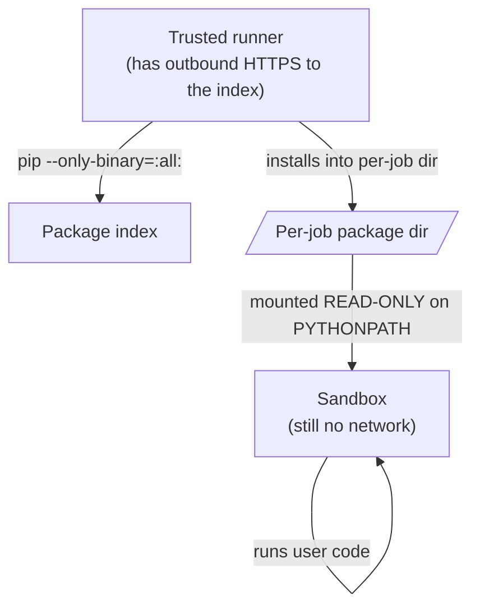

Beyond the runtimes baked into the packages volume, an exec request can declare
extra Python packages to install just for that job.

<Callout type="warn">
This is **off by default**. Enable it with
`CODEAPI_ALLOW_DYNAMIC_DEPENDENCIES=true` only once you understand the
trade-off described below.
</Callout>

## Using it

```bash
curl -sX POST http://localhost:3112/v1/exec \
  -H 'Content-Type: application/json' \
  -d '{
    "lang": "py",
    "code": "import cowsay; cowsay.cow(\"hello\")",
    "dependencies": { "pip": ["cowsay==6.1"] }
  }'
```

Each entry must be a pinned `name==version` spec, optionally carrying one or
more ` --hash=sha256:...` options:

```json
{
  "dependencies": {
    "pip": [
      "cowsay==6.1 --hash=sha256:a1b2c3...",
      "requests==2.32.3 --hash=sha256:d4e5f6..."
    ]
  }
}
```

<Callout type="info">
When **any** package carries a hash, **all** of them must, and pip runs with
`--require-hashes`. It is all or nothing by design: a partially hashed list
would give a false sense of integrity.
</Callout>

## How the security boundary survives

Installs happen **before** user code runs, in the trusted runner, not inside
the sandbox:



The properties that matter:

- **The sandbox gains no new capability.** Only the trusted runner reaches the
  index (`CODEAPI_DEPENDENCY_INDEX_URL`, PyPI by default). The sandbox still has
  no network at all.
- **No install-time code executes.** `pip --only-binary=:all:` means wheels
  only, so no `setup.py` and no build scripts run. This is the single most
  important property: arbitrary code execution at install time would happen in
  the *trusted* context, which would be far worse than anything the sandbox can
  do.
- **The result is read-only to the sandbox.** The per-job directory is mounted
  read-only on `PYTHONPATH`.
- **The spec grammar is the boundary.** Only `--hash` options are accepted, the
  requirement token can never begin with `-`, and no whitespace or shell
  metacharacters survive validation. Nothing can smuggle in an extra pip option
  like `--index-url`, `--editable`, a URL, or a local path.

## Limits

| Variable | Default | Controls |
| --- | --- | --- |
| `CODEAPI_DEPENDENCY_MAX_COUNT` | `50` | Packages per job |
| `CODEAPI_DEPENDENCY_INSTALL_TIMEOUT_MS` | `120000` | Install timeout |
| `CODEAPI_DEPENDENCY_MAX_BYTES` | `262144000` | Total install size (250 MB) |
| `CODEAPI_DEPENDENCY_INDEX_URL` | `https://pypi.org/simple` | Where wheels come from |

## What is not supported

- **Source-only packages.** Anything without a prebuilt wheel for the runtime
  (CPython version + architecture) is **rejected**, not built from source. This
  is deliberate, not a gap to work around.
- **Native extensions needing compilation.** Same reason.
- **npm and Bun.** The `pip` key is the only one implemented; `npm` and `bun`
  keys are reserved for later.
- **Unpinned versions.** `cowsay` alone is rejected; `cowsay==6.1` is required.

## The trade-off you are accepting

Enabling this means:

1. **The runner needs outbound HTTPS** to your configured index. That is a
   network path from a trusted component to the internet, where none existed
   before.
2. **You are installing operator-allowed packages from that index at job time.**
   Wheels only, so no install-time code runs, but the package contents then
   execute inside the sandbox as part of the user's program.
3. **Availability now depends on the index.** An index outage becomes a job
   failure for requests that use it.

<Callout type="warn">
If you enable this, consider pointing `CODEAPI_DEPENDENCY_INDEX_URL` at an
internal mirror holding only packages you have vetted. That keeps the
convenience while narrowing the supply-chain surface to a set you control.
</Callout>

## The alternative

For packages you use routinely, extending the baked-in set is better:

- Add them to `build-packages.sh` (Python) or `javascript-packages.txt` (JS/TS)
- Rebuild the volume with `FORCE_REBUILD=true`

They are then installed once, available instantly with no per-job latency, and
need no network at job time. See
[Languages and runtimes](/docs/guides/languages#adding-packages-beyond-the-preinstalled-set).

## Errors

| Symptom | Cause |
| --- | --- |
| `400` mentioning dependencies | The feature is disabled, or a spec failed validation. |
| Rejected for a missing wheel | No prebuilt wheel for this CPython version and architecture. |
| Install timeout | Raise `CODEAPI_DEPENDENCY_INSTALL_TIMEOUT_MS`, or the index is slow or unreachable. |
| Size limit exceeded | The resolved set exceeded `CODEAPI_DEPENDENCY_MAX_BYTES`. |
