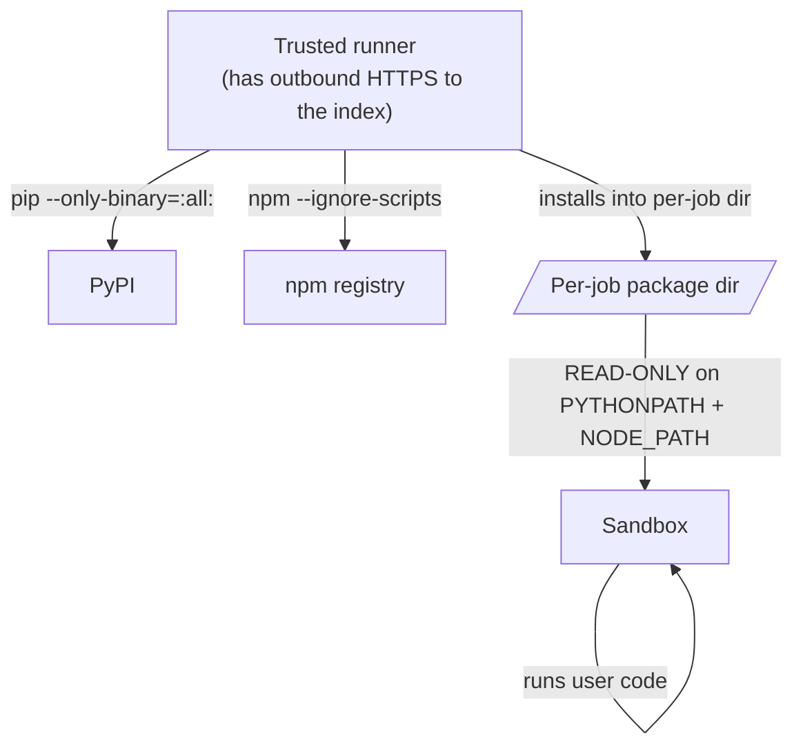

Beyond the runtimes baked into the packages volume, a job can declare extra
packages to install just for itself, by writing a `requirements:` comment in
the code. pip and npm are supported.

<Callout type="warn">
This is **off by default**. Enable it with
`CODEAPI_ALLOW_DYNAMIC_DEPENDENCIES=true` only once you understand the
trade-off described below.
</Callout>

## Using it

Put a declaration in a comment at the top of the code. Both comment styles are
accepted, and the package manager follows the job's language — pip for Python
and bash, npm for JS/TS:

```python
# requirements: cowsay==6.1, requests==2.32.3
import cowsay
cowsay.cow("hello")
```

```javascript
// requirements: lodash@4.17.21
const _ = require("lodash");
```

Several packages go on one line, comma-separated. pip specs may each carry one
or more ` --hash=sha256:...` options.

Add a qualifier when the manager is not the language's default — a bash job
that drives both `python3` and `node`, for instance:

```bash
# requirements: cowsay==6.1
# requirements(npm): lodash@4.17.21
```

The installer is taken from the matching runtime regardless of the job's own
language, so a bash job can declare either or both. Naming a manager that is
not implemented (`# requirements(cargo): serde`) is an error, not a silent
no-op.

<Callout type="info">
**Why a comment and not a request field?** Because the caller that needs this
is usually a model writing code through a fixed tool schema, and it cannot add
fields to that schema. It can always write a line of code. An earlier version
of this feature used a `dependencies` request field; it was unreachable for
every LLM integration and has been removed.
</Callout>

The declaration is found anywhere in the first 64 KB of a submitted file,
whitespace and capitalisation are forgiving, and duplicate specs across files
are collapsed. Prose that merely mentions the word is not a declaration —
`# requirements are listed in README` declares nothing.

<Callout type="info">
When **any** package carries a hash, **all** of them must, and pip runs with
`--require-hashes`. It is all or nothing by design: a partially hashed list
would give a false sense of integrity.
</Callout>

## How the security boundary survives

The declaration is only an *input*. Installs happen **before** user code runs,
in the trusted runner, not inside the sandbox — parsing a comment does not give
the sandbox any new power, it only chooses which pinned wheels the trusted side
fetches:



The properties that matter:

- **The install runs outside the jail.** This is what makes it work at all for
  anything substantial: the jail is capped at 256 MB of memory, 64 processes
  and a 20 MB `/tmp`, which an in-sandbox `pip install` or `npm install` of any
  size gets OOM-killed by. The trusted runner has none of those limits.
- **The sandbox gains no new capability.** Only the trusted runner reaches the
  index (`CODEAPI_DEPENDENCY_INDEX_URL` / `CODEAPI_DEPENDENCY_NPM_REGISTRY`).
- **Everything installed came from your index, transitively.** `--index-url` and
  `--registry` only route the specs the runner passes; a package on the index is
  free to declare a dependency as a direct URL (`child @ https://other/x.whl`,
  or a git ref for npm), and both installers would fetch it. Neither has a
  setting that forbids it, so the resolved tree is verified afterwards instead —
  npm against the lockfile, pip against its `--report` — and the job fails
  before it runs if anything came from somewhere else. The npm check honours a
  path-scoped registry, so a different repository on the same host is refused
  too. Combined with `--ignore-scripts` and wheels-only, nothing from an
  unapproved host has executed.
- **No install-time code executes.** `pip --only-binary=:all:` means wheels
  only, so no `setup.py` runs; `npm --ignore-scripts` is the exact counterpart,
  refusing `preinstall`/`install`/`postinstall` hooks. This is the single most
  important property: arbitrary code execution at install time would happen in
  the *trusted* context, which would be far worse than anything the sandbox can
  do.
- **The result is read-only to the sandbox.** The per-job directory is mounted
  read-only at `/mnt/deps`, on `PYTHONPATH` for Python and as the workspace's
  `node_modules` for JavaScript. It is executable — unlike `/mnt/data` — which
  is why compiled extensions and native npm binaries load from it and not from
  anything the sandbox can write.
- **Declared npm packages win over the baked ones.** `/mnt/data/node_modules`
  points at the per-job install and the runtime's own packages answer from one
  directory up, so Node's ordinary resolution finds a declared version first
  and still falls back to the baked set. `NODE_PATH` alone cannot do this: ESM
  `import` ignores it, and CommonJS consults it only *after* the workspace.
- **The spec grammar is the boundary.** A spec can never begin with `-` (so it
  cannot become `--index-url` or `--registry`), can never be a URL, a git ref,
  or a filesystem path, and carries no whitespace. For npm that also rules out
  `file:`, `git+ssh://`, and `alias@npm:other` — every way of installing from
  somewhere the operator did not configure.

## Limits

| Variable | Default | Controls |
| --- | --- | --- |
| `CODEAPI_DEPENDENCY_MAX_COUNT` | `50` | Packages per job |
| `CODEAPI_DEPENDENCY_REQUIRE_PINNED` | `true` | Require `name==version` (see below) |
| `CODEAPI_DEPENDENCY_INSTALL_TIMEOUT_MS` | `120000` | Install timeout |
| `CODEAPI_DEPENDENCY_MAX_BYTES` | `262144000` | Total install size (250 MB) |
| `CODEAPI_DEPENDENCY_INDEX_URL` | `https://pypi.org/simple` | Where wheels come from |
| `CODEAPI_DEPENDENCY_NPM_REGISTRY` | `https://registry.npmjs.org` | Where npm packages come from |

<Callout type="warn">
  **npm requirements need the `node` runtime installed.** Bun-backed JS runtimes
  (`CODEAPI_LANGUAGES=python,bun`) register as `bun` and ship no npm, but `js`
  and `ts` jobs still default to the npm manager — so a `// requirements:` job
  fails during prime with a message telling you to add `node` to
  `CODEAPI_LANGUAGES`. Bun's own installer is not used as a fallback: it writes
  a different lockfile format, and the registry verification above reads npm's.
</Callout>

The count, size and time budgets are shared across both managers: a job
declaring pip and npm packages gets one 250 MB ceiling, not two.

On Kubernetes these live under the `dependencies` chart value rather than in
`workerSandbox.sandboxExtraEnv`, which rejects `CODEAPI_`-prefixed names, and
enabling the feature also opens the sandbox tier's NetworkPolicy far enough to
reach the index — see
[Kubernetes](/docs/guides/deployment/kubernetes#dependencies-and-sandbox-networking).

## What is not supported

- **Source-only packages.** Anything without a prebuilt wheel for the runtime
  (CPython version + architecture) is **rejected**, not built from source. The
  npm equivalent: a package whose usable form depends on an install script will
  not work, because those scripts are refused.
- **Other language ecosystems.** pip and npm are implemented. Maven, cargo, Go
  modules, composer and CRAN are not, and are refused by name rather than
  ignored. Most of them exist to *build* rather than to fetch prebuilt
  artifacts, and running a build in the trusted runner is exactly the property
  this design refuses to give up.
- **Automatic detection.** Imports are not scanned and nothing is guessed. A
  package is installed only because the code explicitly named it, at a version
  it explicitly pinned — guessing package names from a model's imports is how
  typosquatted lookalikes get installed.

## The trade-off you are accepting

Enabling this means:

1. **The runner needs outbound HTTPS** to your configured index. That is a
   network path from a trusted component to the internet, where none existed
   before.
2. **You are installing operator-allowed packages from that index at job time.**
   Wheels only, so no install-time code runs, but the package contents then
   execute inside the sandbox as part of the user's program.
3. **Availability now depends on the index.** An index outage becomes a job
   failure for requests that use it.

<Callout type="warn">
If you enable this, consider pointing `CODEAPI_DEPENDENCY_INDEX_URL` at an
internal mirror holding only packages you have vetted. That keeps the
convenience while narrowing the supply-chain surface to a set you control.
</Callout>

## Pinned or not

By default a spec must be a pinned `name==version`. That is the right default
for a shared deployment: a run is reproducible, and a compromised *new* release
of a package cannot change what an already-working job installs.

It is also the single biggest source of friction for a model, which rarely
knows real version numbers and will confidently pin one that was never
published. Set `CODEAPI_DEPENDENCY_REQUIRE_PINNED=false` and bare names and
ranges are accepted too:

```python
# requirements: cowsay, requests>=2.32, pandas>=2,<3, requests[socks]
```

What does **not** change when you relax it: wheels only, no `setup.py`, the
per-job package/size/time budgets, and the rule that a spec can never smuggle a
pip option. Extras and version ranges are allowed; environment markers (`;`),
direct URLs (`@ https://...`), and local paths are still refused, because those
are the forms that let a requirement point somewhere other than your index.

<Callout type="info">
The protection that matters most is not the pin — it is that the requirement
list is written to a requirements *file* and pip is spawned with an argv array,
never through a shell. Shell metacharacters are inert here. What a requirements
file *does* interpret is a line beginning with `-` as a pip option, which is
exactly what the grammar's leading-character rule refuses.
</Callout>

## How a model discovers it

Nothing tells the model this convention exists — the tool description belongs
to the integration, not to this service. So the runner teaches it at the one
moment it matters: when a run fails with `ModuleNotFoundError` and no
requirements were declared, a single hint line is appended to stderr showing
the syntax. The model reads the failure, retries with a declaration, and the
second attempt succeeds. The hint is only added when the feature is enabled, so
it can never suggest something that would be rejected.

## The alternative

For packages you use routinely, extending the baked-in set is better:

- Add them to `build-packages.sh` (Python) or `javascript-packages.txt` (JS/TS)
- Rebuild the volume with `FORCE_REBUILD=true`

They are then installed once, available instantly with no per-job latency, and
need no network at job time. See
[Languages and runtimes](/docs/guides/languages#adding-packages-beyond-the-preinstalled-set).

## Errors

| Symptom | Cause |
| --- | --- |
| `400` mentioning dependencies | The feature is disabled, or a spec failed validation. |
| `ModuleNotFoundError`, with a hint in stderr | The code imported something it never declared. The hint shows the syntax; the caller can retry with a declaration. |
| Rejected for a missing wheel | No prebuilt wheel for this CPython version and architecture. |
| Install timeout | Raise `CODEAPI_DEPENDENCY_INSTALL_TIMEOUT_MS`, or the index is slow or unreachable. |
| Size limit exceeded | The resolved set exceeded `CODEAPI_DEPENDENCY_MAX_BYTES`. |
