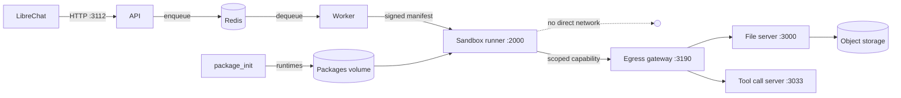

The repository ships several Compose files and a Helm chart. They are not
alternatives to pick arbitrarily: each targets a specific situation.

## Pick a path

<Cards>
  <Card
    title="Docker Compose"
    description="Single host. Local development, evaluation, and small self-hosted deployments."
    href="/docs/guides/deployment/docker-compose"
  />
  <Card
    title="Without KVM"
    description="Hosts with no usable /dev/kvm. Weaker isolation: read the caveat."
    href="/docs/guides/deployment/without-kvm"
  />
  <Card
    title="Kubernetes"
    description="The Helm chart. The supported path for production self-hosting."
    href="/docs/guides/deployment/kubernetes"
  />
  <Card
    title="Production hardening"
    description="What you must change before running untrusted code from real users."
    href="/docs/guides/deployment/hardening"
  />
</Cards>

## The Compose files

| File | What it is for |
| --- | --- |
| `docker-compose.yaml` | The default. Builds every image from source, microVM mode on. |
| `docker-compose.prebuilt.yml` | Same topology, but pulls published images from GHCR instead of building. `linux/amd64` only. |
| `docker-compose.nokvm.yml` | **Override** layered onto the default file to disable the microVM. |
| `docker-compose.scalable.yml` | Multi-worker topology, closer to how the Helm chart lays things out. |
| `docker-compose.scalable.nokvm.yml` | The no-KVM override for the scalable stack. |
| `docker-compose.local-dev.yml` | Development conveniences: source mounts and faster rebuild loops. |
| `docker-compose.mac.yml` | macOS adjustments. |

The `.nokvm.yml` files are overrides, not standalone stacks. Layer them:

```bash
docker compose -f docker-compose.yaml -f docker-compose.nokvm.yml up
```

## Choosing between them

**Evaluating, or developing against the API?** Use the default
`docker-compose.yaml`, restricted to one language:

```bash
CODEAPI_LANGUAGES=python docker compose up --build
```

**No `/dev/kvm` on the host?** Layer the no-KVM override, and read
[the isolation caveat](/docs/guides/deployment/without-kvm): this is a real
reduction in the security boundary, not a formality.

**Running this for other people?** Use the
[Helm chart](/docs/guides/deployment/kubernetes) and work through
[production hardening](/docs/guides/deployment/hardening) first. The defaults in
the Compose files are development defaults: shared secrets are inlined, and
`LOCAL_MODE=true` disables authentication entirely.

## What comes up

Whichever path you take, the same set of components runs:



The sandbox never talks to the file server, Redis, or the network directly.
Its only outbound path is the egress gateway, which checks a signed capability
on every request. See [Architecture](/docs/developers/architecture) for the
full picture.
