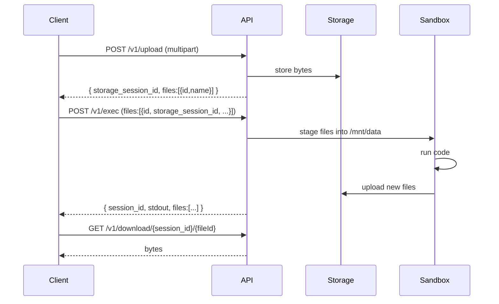

Files move through the service in a loop: you upload them, the sandbox stages
them into its workspace, code reads and writes, and anything left behind comes
back as a downloadable artifact.

## The lifecycle



## Uploading

```bash
curl -sX POST http://localhost:3112/v1/upload \
  -F 'file=@data.csv' \
  -F 'kind=user' | jq
```

```json title="Response"
{
  "message": "success",
  "storage_session_id": "7fZq2NkP0aRcVbXsLmTdY",
  "files": [
    {
      "id": "V1StGXR8Z5jdHi6BmyT",
      "name": "data.csv",
      "storage_session_id": "7fZq2NkP0aRcVbXsLmTdY",
      "size": 20481,
      "contentType": "text/csv"
    }
  ]
}
```

Keep both the `storage_session_id` and each file's `id` — you need both to
reference the file later.

<Callout type="info" title="The service chooses the storage session">
You never pick a storage session or namespace. The service mints one and
derives its namespace from your authenticated identity, which is what stops one
caller from addressing another's files.
</Callout>

### Form fields

| Field | Required | Purpose |
| --- | --- | --- |
| `file` | Yes | One or more file parts. Repeat for multiple. |
| `kind` | Yes | `user`, `agent`, or `skill` — see [file kinds](/docs/guides/concepts#file-kinds). |
| `id` | For shared kinds | Resource id owning the storage session. |
| `version` | For `skill` | Required when `kind=skill`, rejected otherwise. |
| `read_only` | No | `true` marks these as infrastructure inputs that must never be emitted back as outputs, even if code modifies them on disk. |

Subdirectory components in filenames are preserved, so `pptx/editing.md`
arrives as a nested path rather than being flattened to a basename.

### Limits

| Limit | Default | Variable |
| --- | --- | --- |
| Per-file size | 25 MiB | `MAX_FILE_SIZE` |
| Uploads per window | 30 per 5 min | `UPLOAD_MAX_REQUESTS` |

Exceeding the size limit returns `413`; the rate limit returns `429` with a
`Retry-After` header.

### Batch uploads

`POST /v1/upload/batch` has the same contract, tuned for writing many files into
a single storage session in one request — the shape skill bundles use.

## Using files in a run

Reference them in the `files` array of your exec request:

```bash
curl -sX POST http://localhost:3112/v1/exec \
  -H 'Content-Type: application/json' \
  -d '{
    "lang": "py",
    "code": "import pandas as pd\nprint(pd.read_csv(\"data.csv\").describe())",
    "files": [{
      "id": "V1StGXR8Z5jdHi6BmyT",
      "resource_id": "user-42",
      "storage_session_id": "7fZq2NkP0aRcVbXsLmTdY",
      "name": "data.csv",
      "kind": "user"
    }]
  }' | jq
```

Each entry needs:

| Field | Meaning |
| --- | --- |
| `id` | The storage file id from the upload response. |
| `storage_session_id` | The storage session from the upload response. |
| `name` | The filename to write inside `/mnt/data`. Need not match the original. |
| `kind` | The resource kind. |
| `resource_id` | The entity owning the storage session; informational for `user`. |
| `version` | Required when `kind` is `skill`. |

The file is staged into `/mnt/data` under `name`, which is the working
directory, so code opens it by bare filename.

<Callout type="warn" title="Two different session ids">
`storage_session_id` is where the file's bytes live. It is **not** the
`session_id` of the execution you are starting. Mixing them up is the most
common file-handling error — see [core concepts](/docs/guides/concepts#session_id-versus-storage_session_id).
</Callout>

## Collecting outputs

Anything the run leaves in `/mnt/data` comes back in the response's `files`:

```json
{
  "session_id": "Kd8vN2mPxQ7wLzR4bYtCa",
  "stdout": "",
  "files": [
    { "id": "8ZqL2mVxRt0PnCbWyKdSa", "name": "chart.png", "storage_session_id": "Kd8vN2mPxQ7wLzR4bYtCa", "kind": "user" }
  ]
}
```

For output files the `storage_session_id` equals the run's `session_id` — a run
writes its outputs under its own execution session.

### The `inherited` flag

Some refs carry `inherited: true`. That means the ref is an unchanged
passthrough of an input you already own, not something the run created.

Skip post-processing those. Re-downloading a skill- or agent-scoped input with
the end user's session key will `403`, and it is wasted work regardless — the
bytes are already persisted where they came from.

### The `modified_from` field

When a run modified a staged input rather than creating a new file, the output
ref carries `modified_from` pointing at the original `{ id, storage_session_id }`.

## Downloading

```bash
curl -s http://localhost:3112/v1/download/{session_id}/{fileId} -o chart.png
```

Rate limited to 60 downloads per minute by default.

## Listing and deleting

```bash
# List a session's files
curl -s http://localhost:3112/v1/files/{session_id} | jq

# With full metadata
curl -s 'http://localhost:3112/v1/files/{session_id}?detail=full' | jq

# One file's metadata, no bytes
curl -s http://localhost:3112/v1/sessions/{session_id}/objects/{fileId} | jq

# Delete
curl -sX DELETE http://localhost:3112/v1/files/{session_id}/{fileId}
```

The metadata route exists for freshness checks: read `lastModified` to decide
whether a previously uploaded bundle is still present before re-uploading it.
Without it, every priming call falls through to a fresh upload — a lot of
needless egress at scale.

## Access control

Every file route is scoped to the authenticated principal. The service derives
the storage namespace from your identity and the resource kind; requesting a
session that derives to a different namespace fails rather than returning
someone else's data.

This is why there is no "list all my sessions" endpoint — the caller is expected
to track the session ids it received.

## Complete example

<Steps>
<Step>
### Upload an input

```bash
UPLOAD=$(curl -sX POST http://localhost:3112/v1/upload \
  -F 'file=@sales.csv' -F 'kind=user')

STORAGE=$(echo "$UPLOAD" | jq -r '.storage_session_id')
FILE_ID=$(echo "$UPLOAD" | jq -r '.files[0].id')
```
</Step>

<Step>
### Run code against it

```bash
RESULT=$(curl -sX POST http://localhost:3112/v1/exec \
  -H 'Content-Type: application/json' \
  -d "{
    \"lang\": \"py\",
    \"code\": \"import pandas as pd, matplotlib.pyplot as plt\\ndf = pd.read_csv('sales.csv')\\ndf.plot()\\nplt.savefig('sales.png')\",
    \"files\": [{
      \"id\": \"$FILE_ID\",
      \"resource_id\": \"user-42\",
      \"storage_session_id\": \"$STORAGE\",
      \"name\": \"sales.csv\",
      \"kind\": \"user\"
    }]
  }")
```
</Step>

<Step>
### Download the artifact

```bash
SESSION=$(echo "$RESULT" | jq -r '.session_id')
OUT_ID=$(echo "$RESULT" | jq -r '.files[] | select(.name=="sales.png") | .id')

curl -s "http://localhost:3112/v1/download/$SESSION/$OUT_ID" -o sales.png
```
</Step>
</Steps>

## Related

<Cards>
  <Card
    title="Persistent sessions"
    description="Keep /mnt/data across runs instead of starting fresh each time."
    href="/docs/guides/sessions"
  />
  <Card
    title="API reference"
    description="Full schemas for every file endpoint."
    href="/docs/reference/api/files/upload/post"
  />
</Cards>
