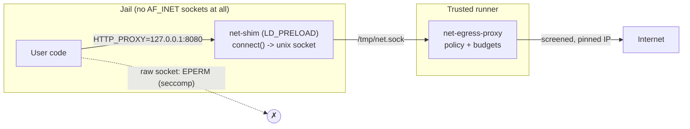

By default the sandbox has no network at all. This feature gives user code
ordinary outbound HTTP and HTTPS — `requests`, `urllib`, `curl`, `fetch` — while
keeping every decision about *where* it may connect on the trusted side.

<Callout type="warn">
This is **off by default**. It is the single biggest change you can make to the
sandbox's threat model: untrusted code that can read your input files can now
send them somewhere. Read "The trade-off" below before enabling it.
</Callout>

## Using it

```bash
CODEAPI_ALLOW_SANDBOX_NETWORK=true
```

That is the whole setup. Every execution then runs with `HTTP_PROXY` and
`HTTPS_PROXY` pointing at a loopback port inside the jail, which standard
tooling picks up automatically:

```python
import requests
print(requests.get("https://api.github.com/zen").text)
```

There is no request field to set and nothing for the model to learn — the same
reason the model cannot install packages on its own applies here, so the
capability is switched on for every job or for none.

On Kubernetes the flag lives in chart values instead, because
`workerSandbox.sandboxExtraEnv` rejects `CODEAPI_`-prefixed names. Setting
`sandboxNetwork.enabled: true` also opens the sandbox tier's NetworkPolicy to
public addresses, which the proxy needs to reach anything at all — see
[Kubernetes](/docs/guides/deployment/kubernetes#dependencies-and-sandbox-networking).

## How it works



The client believes it is connecting to `127.0.0.1:8080`. `net-shim`, preloaded
into the process, turns that one `connect()` into a connect on the bind-mounted
unix socket — so **no `AF_INET` socket is ever created**, and the seccomp rule
blocking `AF_INET`/`AF_INET6` stays exactly as strict as it is for every other
job. Everything that decides where traffic may go runs in
`net-egress-proxy.ts`, on the other side of that socket, outside the sandbox.

The shim is a convenience, never a boundary. Code that avoids it — clearing
`LD_PRELOAD`, calling `socket()` by raw syscall, linking statically — does not
gain access; it loses it, because the unchanged seccomp rule refuses the
syscall with `EPERM`. **Bypassing the shim fails closed.**

The proxy's rules, in order:

1. **Request shape.** Absolute-form `http://` targets and `CONNECT` only, one
   request per connection, length-delimited bodies only. Chunked framing,
   pipelining, obs-folds, bare LF, conflicting `Content-Length`, `Upgrade` and
   `TRACE` are all refused rather than parsed — a connection is bound to a
   single validated origin for its whole life.
2. **Host gate.** An infrastructure-name denylist (`*.internal`, `*.local`,
   `metadata.google.internal`, …) and, if you configure one, your allowlist.
3. **Port gate.** `SANDBOX_NET_ALLOWED_PORTS`, `80,443` by default.
4. **Address gate.** The proxy resolves the name itself and every returned
   address must be publicly routable. Private, loopback, link-local (including
   `169.254.169.254`), CGNAT, ULA, multicast, reserved, IPv4-mapped, NAT64,
   Teredo and 6to4 addresses are all refused, and this cannot be configured
   away. If a name answers with both a public and a private address, the whole
   request is refused.
5. **Pinning.** The socket is opened to the approved IP with the resolver
   bypassed, and the kernel's view of the peer is re-checked after connect. DNS
   rebinding has no window to exploit.

Because it is a forward proxy, redirects are **not** followed by the proxy: a
3xx goes back to the client, which issues a fresh request that runs the full
gate again. HTTPS rides an opaque `CONNECT` tunnel — the proxy never terminates
TLS, so there is no certificate handling and no interception surface.

<Callout type="info">
  **The tunnel is bound to its TLS SNI.** The `CONNECT` authority is the name the
  host gate approved, but a server decides which virtual host you reach from the
  SNI — and a name on a CDN or shared host usually shares its address with many
  others. So the proxy reads the SNI out of the first ClientHello (read-only;
  still no TLS termination) and runs the same host gate on it. That applies with
  or without an allowlist, because the infrastructure denylist always does: a
  split-horizon name like `admin.internal` can resolve to the same public edge as
  an ordinary site, and `CONNECT` to the ordinary name with the denied name in
  the SNI would otherwise reach it.

  What the allowlist changes is a tunnel with **no** name in it. With
  `SANDBOX_NET_ALLOWED_HOSTS` set, the authority is the boundary, so a tunnel
  carrying no SNI — or not opening with a ClientHello at all — cannot be bound
  to it and is closed. Without one, the destination was already settled by the
  address gate and there is no name to smuggle, so such a tunnel stays fully
  opaque and carries any protocol.
</Callout>

## Why the shim exists instead of a loopback listener

The natural design is a relay listening on `127.0.0.1` inside the jail, with
seccomp relaxed to permit `AF_INET`. That was built, deployed, and reverted.

On the KVM/libkrun runner it is **not safe**. libkrun uses TSI (transparent
socket impersonation): the guest kernel intercepts `AF_INET` at the socket
layer and forwards the connection to the host over vsock. No packet is ever
routed, so `clone_newnet` never sees it — the jail's empty network namespace
constrains nothing. Measured on a live hardened deployment on 2026-07-31: with
`AF_INET` permitted, sandboxed Python received a genuine UDP DNS answer from
`1.1.1.1` and opened raw TCP to public hosts, while the proxy correctly denied
the same destinations over HTTP.

The lesson generalizes beyond this feature: on a libkrun runner the seccomp
rule is the *only* thing keeping user code off the network, and the network
namespace is not a second layer. The shim exists so that rule never has to be
relaxed.

## Limits

| Variable | Default | Controls |
| --- | --- | --- |
| `CODEAPI_ALLOW_SANDBOX_NETWORK` | `false` | The feature itself |
| `SANDBOX_NET_ALLOWED_HOSTS` | *(empty)* | Host allowlist; empty or `*` means any public host |
| `SANDBOX_NET_ALLOWED_PORTS` | `80,443` | Destination ports |
| `SANDBOX_NET_MAX_BYTES` | `268435456` | Bytes per job, both directions |
| `SANDBOX_NET_MAX_REQUESTS` | `512` | Requests per job |
| `SANDBOX_NET_MAX_CONNECTIONS` | `32` | Concurrent connections per job |
| `SANDBOX_NET_IDLE_TIMEOUT_MS` | `60000` | Silence before a connection is torn down |

An allowlist entry is either an exact host (`api.github.com`) or one wildcard
label (`*.pypi.org`, which also matches `pypi.org`). Anything that is not a
valid pattern is dropped rather than widening the policy.

Every allowed and denied request is logged with its host, port and resolved
address, and each job logs a usage summary.

## What is not supported

- **Inbound connections.** Nothing can reach into the sandbox.
- **Non-HTTP protocols.** No raw TCP, DNS, SMTP, SSH or WebSockets — the only
  way out is the HTTP proxy, and `Upgrade` is refused.
- **Chunked request bodies.** Send `Content-Length`. A chunk parser would put
  sandbox-controlled framing in charge of trusted-side state.
- **Reaching your own infrastructure.** Private addresses are refused by
  design. An internal mirror must be published on a publicly routable address,
  or reached through the tool-call mechanism instead.

## The trade-off you are accepting

1. **Exfiltration becomes possible.** Untrusted code can send any data it can
   read — input files, session state, its own environment — to any host the
   policy permits. A host allowlist narrows this; it does not remove it.
2. **Inbound content becomes an input.** Code now pulls in data you do not
   control, which then executes or is processed inside the job.
3. **Availability now depends on the network.** A slow or unreachable
   destination becomes a job that hangs until its idle timeout.

<Callout type="warn">
If you enable this, set `SANDBOX_NET_ALLOWED_HOSTS` to the smallest set that
does the job. "Any public host" is the right default only when you already
treat everything the sandbox can read as non-sensitive.
</Callout>

## Errors

| Symptom | Cause |
| --- | --- |
| `403` mentioning a host or address | The host, port, or resolved address failed a gate. |
| `403 host resolves to a non-public address` | Split-horizon DNS or a private-only name. |
| `411` on an upload | The client used chunked framing; send `Content-Length`. |
| `429 per-job request limit reached` | `SANDBOX_NET_MAX_REQUESTS` or the byte budget is exhausted. |
| `502 upstream connection failed` | The origin refused or is unreachable. |
| Connection refused inside the sandbox | Networking is off for this job, or the runner image predates `net-shim.so`. |
| Runner refuses to start, naming `net-shim.so` | The flag is on but the shim is missing; rebuild the sandbox image. |
| `EPERM` / `PermissionError` on a socket | Code bypassed the shim (static binary, raw syscall, cleared `LD_PRELOAD`). Working as intended. |

## See also

- [The egress model](/docs/developers/egress) — how files and tool calls leave a
  sandbox that has no network of its own.
- [Sandbox isolation](/docs/developers/sandbox-isolation) — the namespace and
  seccomp posture this feature amends.
