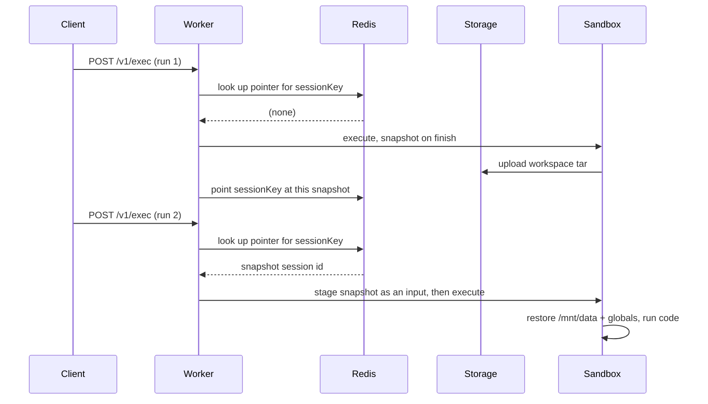

By default every execution is one-shot: a fresh workspace is created, the code
runs, and everything is discarded.

Set `CODEAPI_PERSIST_SESSIONS=true` and runs continue each other automatically.
**No client change is required** — the same `/v1/exec` call now resumes where
the last one left off.

```bash
CODEAPI_PERSIST_SESSIONS=true
```

## What carries over

- **Files.** Anything left under `/mnt/data` is there next time.
- **Variables (Python).** The run's global namespace is serialized with `dill`
  and restored, so a `df` defined in one call is still live in the next.

The notebook experience, without a warm kernel:

```bash
# First call
curl -sX POST localhost:3112/v1/exec -H 'Content-Type: application/json' \
  -d '{"lang":"py","code":"import pandas as pd\ndf = pd.DataFrame({\"a\":[1,2,3]})\nprint(len(df))"}'
# stdout: "3\n"

# Second call — df is still there
curl -sX POST localhost:3112/v1/exec -H 'Content-Type: application/json' \
  -d '{"lang":"py","code":"print(df.sum().to_dict())"}'
# stdout: "{'a': 6}\n"
```

## How it works

At the end of a run the `/mnt/data` workspace is tarred and uploaded to object
storage under the caller's own `sessionKey` — derived server-side from
authentication and already bound into the signed execution manifest. The next
run restores it before user code executes.



Continuity is keyed on the `sessionKey`, so nothing new is sent by the client
and **one user can never read another's state**. State lives in shared object
storage, so it survives across a horizontally scaled, affinity-free worker pool
— run 2 does not need to land on the same worker as run 1.

The sandbox network posture is unchanged: the snapshot is written and read by
the trusted runner, exactly like input downloads and output uploads. User code
still has no network.

The response reports what happened:

| Field | Meaning |
| --- | --- |
| `session_state_persisted` | This run wrote a fresh snapshot. |
| `session_state_restore_failed` | A prior snapshot was expected but could not be restored, so this run started empty. |

## Known limitations

These are by design, not bugs. Read them before enabling.

<Accordions>
<Accordion title="Per user, not per conversation">

No conversation id flows in the request, so continuity is scoped to the
authenticated user or resource. **Two concurrent conversations by the same user
share one namespace.**

Overlapping runs that restored the same snapshot race on a compare-and-swap:
the **first** to finish and publish advances the session, and the later
finisher's snapshot is discarded — never merged, never rolled back. First
successful write wins, not last.

</Accordion>

<Accordion title="Variable snapshots are best-effort">

Data restores reliably — arrays, DataFrames, dicts, ordinary objects. Open
handles, sockets, threads, and some native objects cannot be serialized and are
**dropped with a warning**; the rest is preserved.

File persistence underneath is unaffected by a partial variable snapshot.

</Accordion>

<Accordion title="Not a warm kernel">

The interpreter still cold-starts on each call — re-import, re-restore. This
saves you re-deriving state, not startup latency.

Non-Python languages get **file persistence only**; there is no variable
snapshot for them.

</Accordion>

<Accordion title="Programmatic exec is not covered">

`/v1/exec/programmatic` and its blocking and replay variants build their payload
through a separate path that never sets the persistence marker or wraps the code
for restore and snapshot.

With `CODEAPI_PERSIST_SESSIONS=true`, calls through those routes still get a
cold workspace and namespace every time. **Only the plain `/v1/exec` route
persists.**

</Accordion>

<Accordion title="Abandoned sessions leak their last snapshot">

The Redis pointer mapping a session to its snapshot expires on its own
(`CODEAPI_SESSION_STATE_TTL_SECONDS`) when nobody calls back. But **expiry only
removes the Redis key — it does not delete the snapshot tar in object storage.**
Deletion runs only on explicit supersession by a newer run of the same session.

A session that is never revisited leaves its last snapshot in storage
indefinitely.

**Mitigation:** configure an object lifecycle or expiry policy on the underlying
bucket or prefix until an in-process cleanup sweep exists.

</Accordion>
</Accordions>

## Tuning

| Variable | Default | Meaning |
| --- | --- | --- |
| `CODEAPI_SESSION_STATE_MAX_BYTES` | `104857600` (100 MiB) | Snapshot cap. Oversize snapshots are **skipped — the run still succeeds**, and the previous state stays current. |
| `CODEAPI_SESSION_STATE_TTL_SECONDS` | `604800` (7 days) | Idle expiry of the Redis pointer, refreshed on every run. An active session's pointer never lapses. |

<Callout type="info">
In hardened mode the snapshot upload is exempt from
`EGRESS_GATEWAY_MAX_FILE_BYTES` — that cap sizes *user output files*. The
gateway and egress ledger let the hidden snapshot use a grant cap derived from
`CODEAPI_SESSION_STATE_MAX_BYTES` directly, so that is the **only** knob
bounding snapshot size.
</Callout>

## Operational implications

**Storage grows.** Every active session holds a workspace tar up to the cap.
Budget for it, and set a lifecycle policy for the abandoned-session case above.

**Snapshot size affects latency.** The tar is uploaded at the end of every run
and downloaded at the start of the next. A user who fills `/mnt/data` with a
few hundred MB pays for it on every subsequent call. The cap is as much a
latency control as a storage one.

**Users may be surprised by shared state.** Two browser tabs are two
conversations but one user, and therefore one namespace. If that is wrong for
your product, leave this off.

## Deciding whether to enable it

Good fit when users work iteratively on data — load a dataset once, explore it
across several messages.

Poor fit when users run many independent one-shot snippets (pure overhead),
when conversations must be isolated from each other, or when you cannot set a
storage lifecycle policy.
