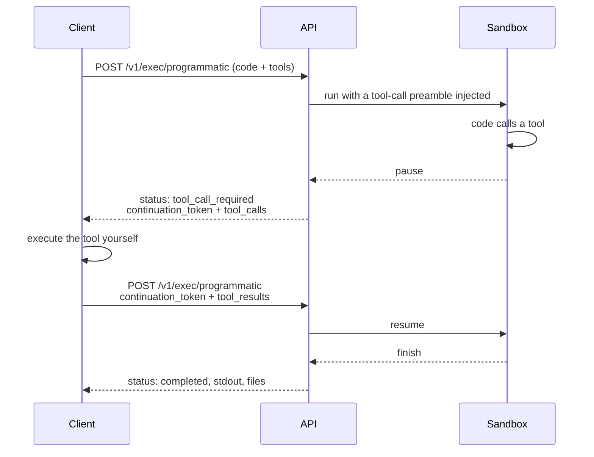

Normal `/v1/exec` runs a program to completion. **Programmatic tool calling**
lets the program stop partway, ask the caller to run a tool, and continue with
whatever comes back: a loop between untrusted code and your trusted
environment.

## The shape of it



The tool itself runs **on your side**, never in the sandbox. The sandbox only
ever emits a request and receives a result.

## First call

```bash
curl -sX POST http://localhost:3112/v1/exec/programmatic \
  -H 'Content-Type: application/json' \
  -d '{
    "language": "python",
    "code": "rate = get_exchange_rate(base=\"USD\", quote=\"EUR\")\nprint(f\"100 USD = {100 * rate} EUR\")",
    "tools": [{
      "name": "get_exchange_rate",
      "description": "Return the exchange rate between two currencies.",
      "parameters": {
        "type": "object",
        "properties": {
          "base":  { "type": "string" },
          "quote": { "type": "string" }
        },
        "required": ["base", "quote"]
      }
    }]
  }' | jq
```

```json title="Response"
{
  "status": "tool_call_required",
  "session_id": "Kd8vN2mPxQ7wLzR4bYtCa",
  "continuation_token": "eyJhbGciOi...",
  "tool_calls": [
    {
      "id": "call_7fZq2NkP",
      "name": "get_exchange_rate",
      "arguments": { "base": "USD", "quote": "EUR" }
    }
  ],
  "partial_stdout": ""
}
```

The declared `tools` become callable functions inside the sandbox. The service
injects a preamble that defines them and handles the pause.

## Resuming

Run the tool yourself, then send the result back with the token:

```bash
curl -sX POST http://localhost:3112/v1/exec/programmatic \
  -H 'Content-Type: application/json' \
  -d '{
    "code": "",
    "session_id": "Kd8vN2mPxQ7wLzR4bYtCa",
    "continuation_token": "eyJhbGciOi...",
    "tool_results": [
      { "call_id": "call_7fZq2NkP", "result": 0.92 }
    ]
  }' | jq
```

```json title="Response"
{
  "status": "completed",
  "session_id": "Kd8vN2mPxQ7wLzR4bYtCa",
  "stdout": "100 USD = 92.0 EUR\n",
  "stderr": "",
  "files": [],
  "tool_calls_made": 1,
  "execution_time": 1284
}
```

A program can pause many times; keep looping while `status` is
`tool_call_required`.

## Response statuses

| `status` | Meaning | What to do |
| --- | --- | --- |
| `tool_call_required` | The program is paused. | Run the `tool_calls`, resume with `tool_results`. |
| `completed` | The program finished. | Read `stdout`, `stderr`, `files`. |
| `error` | The run failed. | Inspect `error` and `error_type`. |

## Reporting a tool failure

Do not fabricate a result when your tool fails, say so:

```json
{
  "tool_results": [{
    "call_id": "call_7fZq2NkP",
    "result": null,
    "is_error": true,
    "error_message": "Rate provider timed out"
  }]
}
```

The sandboxed program sees an error it can handle rather than a plausible-looking
wrong value.

## Languages

Python and Bash. Set `language` to `"python"` (the default) or `"bash"`.

<Callout type="info">
`lang` is accepted as a back-compat alias for `language`. If both are sent,
`language` wins.
</Callout>

## Files

Files work exactly as on `/v1/exec`: pass a `files` array of references and
collect outputs from the final response. See
[Working with files](/docs/guides/files).

## Limitations

<Callout type="warn" title="Persistent sessions do not apply here">
Even with `CODEAPI_PERSIST_SESSIONS=true`, programmatic runs get a **cold
workspace and namespace every time**. These routes build their payload through
a separate path that never sets the persistence marker. Only the plain
`/v1/exec` route persists: see
[Persistent sessions](/docs/guides/sessions#known-limitations).
</Callout>

Other constraints:

- **Timeouts span the whole loop.** Time spent waiting for your tool counts.
  `TOOL_CALL_REQUEST_TIMEOUT` defaults to 300000 ms; `TOOL_CALL_SESSION_EXPIRY`
  (600 s) bounds how long a paused session survives.
- **Tool call payloads are capped** by `EGRESS_GATEWAY_MAX_TOOL_CALL_BYTES`
  (1 MiB by default).
- **Continuation tokens are single-use** and tied to their session.

## The security model

Tool calls leave the sandbox the same way everything else does: through the
[egress gateway](/docs/developers/egress), under the run's signed capability.
The sandbox cannot invent a tool call for a tool that was not declared, cannot
exceed its request budget, and cannot reach the tool call server directly.

The tool call server holds paused sessions in Redis and routes results back to
the right execution. When `CODEAPI_INTERNAL_SERVICE_TOKEN` is set, its
session-management routes require it: [and stay unauthenticated when it is
not](/docs/guides/authentication#internal-service-authentication).

## Related

<Cards>
  <Card
    title="API reference"
    description="Full request and response schemas."
    href="/docs/reference/api/execution/exec/programmatic/post"
  />
  <Card
    title="Egress model"
    description="How anything leaves the sandbox at all."
    href="/docs/developers/egress"
  />
</Cards>
